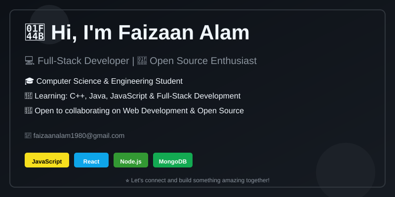

<picture>
  <source media="(prefers-color-scheme: dark)" srcset="dark_mode.svg" />
  <source media="(prefers-color-scheme: light)" srcset="light_mode.svg" />
  
</picture>

# 💫 About Me

Hi, I'm **Faizaan Alam** 👋

🎓 Computer Science & Engineering Undergraduate  
💻 Exploring **Web Development, Software Development & AI**  
🧩 Enjoy solving problems and building practical applications  
🚀 Currently working on personal projects and improving my development skills  
🤝 Open to **Web Development & Open Source collaborations**

📫 **Email:** [faizaanalam1980@gmail.com](mailto:faizaanalam1980@gmail.com)

---

## 🌐 Connect With Me

---

# 💻 Tech Stack

### 👨‍💻 Programming Languages

### 🌐 Web Development

### 🗄️ Database & Backend

### 🛠️ Tools & Platforms

### 🎨 Design & Creative Tools

### 📊 Data & Scientific Computing

---

# 🧠 Currently Learning

- 💻 C++ & Data Structures
- ☕ Java Programming
- ⚡ JavaScript
- 🌐 Full-Stack Web Development
- 🗄️ Databases & Backend Development
- 🧩 Algorithms & Problem Solving
- 🚀 Software Development

---

# 🚀 What I'm Working On

- 🌐 Web Development Projects
- 💻 C++ & Competitive Programming
- ☕ Java Applications
- ⚡ JavaScript Projects
- 🗄️ Database Applications
- 🤖 Software & Automation Projects
- 🌱 Open Source Projects

---

# 📊 GitHub Stats

 

 

---

# 📈 GitHub Activity

---

### ✍️ Random Dev Quote

---

# 🐍 Feeding...

---

## 🤝 Let's Connect

<em>
<b>I genuinely enjoy connecting with new people</b>
so if you'd like to say <b>hi, I'd be delighted to get to know you better!</b> 😊
</em>

---

⭐ **If you find my projects interesting, consider giving them a star!**

💙 Thanks for visiting my profile!
